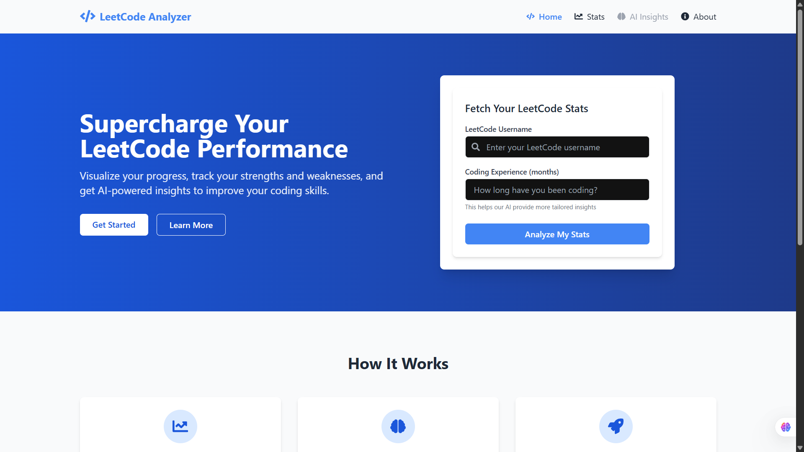
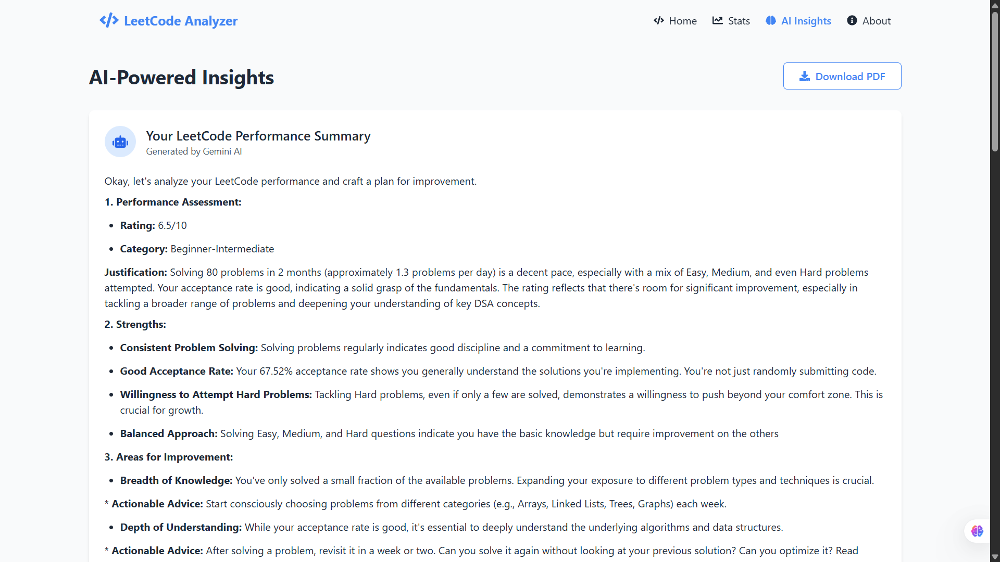

# 🎯 LeetCode Analyzer - React Project

![LeetCode Analyzer]

LeetCode Analyzer is a React-based web application designed to help students visualize and analyze their LeetCode performance. It provides tailored insights, recommendations, and personalized study plans to help users achieve stable improvement in their problem-solving skills.

## 🚀 Live Demo
🌐 The project is deployed and available at: [LeetCode Analyzer](https://leetcodeanalyzer.vercel.app/)

---

## 🌟 Features
- 📊 **Data Visualization**: Fetch and analyze user LeetCode data, displaying performance using beautiful and intuitive graphs.
- ⭐ **Performance Rating**: Rate users' performances based on their problem-solving history.
- 🧠 **Strength Insights**: Provide tailored insights into users' strengths.
- 🎯 **Personalized Study Plans**: Generate weekly checklists with topic-specific study plans.
- 💡 **Practical Implementation Tips**: Offer practical tips to reinforce learning and implementation.

---

## 📸 Screenshots

### 🏠 Home Page

### 🤖 AI Insights Page

---

## 📧 Contact
If you have any questions or feedback, feel free to reach out:

- 💻 **GitHub**: [SayedZahur786](https://github.com/SayedZahur786)
- 🌐 **Live App**: [LeetCode Analyzer](https://leetcodeanalyzer.vercel.app/)
